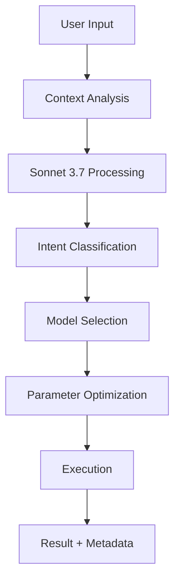

# 🧠 AI Intent Decision System Documentation

## Overview

The AI Intent Decision System is the core intelligence layer of PicArcade that automatically analyzes user prompts and context to determine the optimal creative workflow. This system eliminates the need for manual mode selection by using Claude Sonnet 3.7 via Replicate to understand user intent and route requests to the most appropriate AI models.

## 🎯 System Architecture

### Decision Flow


### Core Components

1. **Intent Detector** (`AIServices.detectUserIntent()`)
2. **Context Analyzer** (analyzes current state)
3. **Model Router** (selects optimal AI model)
4. **Parameter Optimizer** (adjusts model settings)
5. **Fallback Handler** (manages error scenarios)

## 🔍 Intent Classification System

### Primary Intent Categories

#### 1. **CREATE** - Generate New Content
**Triggers:**
- No active images in context
- Prompts indicating new content: "create", "make", "generate", "new"
- Text-only descriptions of desired output

**Examples:**
- "Create a beautiful sunset over mountains"
- "Generate a futuristic cityscape"
- "Make a logo for my coffee shop"

**Routing:**
- **Images**: Stable Diffusion (fallback to legacy API)
- **Videos**: Runway Gen-3 Alpha Turbo
- **Complex scenes**: DALLE (via legacy API)

#### 2. **EDIT** - Modify Existing Content
**Triggers:**
- Active image present in session
- Edit keywords: "edit", "change", "modify", "alter", "adjust", "fix", "update"
- Specific modification requests

**Examples:**
- "Change the sky to be more dramatic"
- "Edit this photo to remove the background"
- "Modify the colors to be warmer"

**Routing:**
- **Primary**: Kontext Max (advanced inpainting)
- **Fallback**: Legacy API with edit parameters

#### 3. **ENHANCE** - Improve Quality/Resolution
**Triggers:**
- Active image present
- Enhancement keywords: "enhance", "improve", "better", "higher quality", "upscale", "sharpen"
- Quality improvement requests

**Examples:**
- "Make this image higher quality"
- "Enhance the details in this photo"
- "Improve the resolution and sharpness"

**Routing:**
- **Primary**: Kontext Max (enhancement mode)
- **Parameters**: Lower strength (0.3-0.5), higher steps

#### 4. **GENERATE** - Create Variations/Styles
**Triggers:**
- Reference images present
- Style keywords: "like this", "similar to", "in the style of", "variation"
- Comparative language

**Examples:**
- "Create something similar to this image"
- "Generate a variation in Van Gogh style"
- "Make a version that looks like this reference"

**Routing:**
- **Style Transfer**: Kontext Max with reference
- **New Variations**: Stable Diffusion with style prompts

#### 5. **MODIFY** - Specific Alterations
**Triggers:**
- Active image present
- Specific change requests
- Object-level modifications

**Examples:**
- "Add sunglasses to this person"
- "Change the car color to red"
- "Replace the background with a beach"

**Routing:**
- **Primary**: Kontext Max (precise inpainting)
- **Parameters**: High strength (0.7-0.9), targeted masking

## 🎛️ Context Analysis Engine

### Context Variables Analyzed

```typescript
interface ContextAnalysis {
  hasActiveImage: boolean      // Previous generation result available
  hasUpload: boolean          // User uploaded new images  
  hasReference: boolean       // @mentions or tagged references
  sessionContinuity: boolean  // Ongoing editing session
  previousContext: string     // History of recent actions
  promptKeywords: string[]    // Extracted significant terms
  contentType: 'image' | 'video' | 'mixed'
  complexity: 'simple' | 'moderate' | 'complex'
}
```

### Context Scoring System

#### Priority Matrix
1. **Active Image Present** (Weight: 0.8)
   - Strong indicator for edit/enhance/modify intents
   - Reduces likelihood of create intent

2. **Upload Present** (Weight: 0.6)
   - Suggests reference-based generation
   - May indicate style transfer or editing needs

3. **Session Continuity** (Weight: 0.4)
   - Indicates iterative editing workflow
   - Biases toward modification operations

4. **Keyword Analysis** (Weight: 0.9)
   - Direct intent indicators from natural language
   - Highest weight due to explicit user expression

## 🤖 Model Selection Logic

### Decision Tree

```
IF hasActiveImage:
    IF keywords.includes(editTerms):
        ROUTE TO: Kontext Max (edit mode)
        CONFIDENCE: 0.8-0.95
    
    ELIF keywords.includes(enhanceTerms):
        ROUTE TO: Kontext Max (enhance mode)  
        CONFIDENCE: 0.85-0.95
    
    ELIF keywords.includes(videoTerms):
        ROUTE TO: Runway (image-to-video)
        CONFIDENCE: 0.9-0.95
    
    ELSE:
        ROUTE TO: Kontext Max (modify mode)
        CONFIDENCE: 0.6-0.8

ELSE: // No active image
    IF keywords.includes(videoTerms):
        ROUTE TO: Runway Gen-3
        CONFIDENCE: 0.9-0.95
    
    ELSE:
        ROUTE TO: Stable Diffusion
        CONFIDENCE: 0.8-0.9
```

### Model Capabilities Matrix

| Model | Create | Edit | Enhance | Video | Style Transfer |
|-------|--------|------|---------|-------|----------------|
| **Kontext Max** | ❌ | ✅✅✅ | ✅✅✅ | ❌ | ✅✅ |
| **Runway Gen-3** | ✅✅ | ❌ | ❌ | ✅✅✅ | ✅ |
| **Runway Image-to-Video** | ❌ | ✅ | ❌ | ✅✅✅ | ✅ |
| **Stable Diffusion** | ✅✅✅ | ❌ | ❌ | ❌ | ✅✅ |
| **Legacy API** | ✅ | ✅ | ✅ | ✅ | ✅ |

## 🎯 Parameter Optimization

### Dynamic Parameter Adjustment

```typescript
interface OptimizedParameters {
  strength: number        // 0.0-1.0 (edit influence)
  guidance_scale: number  // 1-30 (prompt adherence)
  steps: number          // 20-100 (quality vs speed)
  seed: number | null    // Reproducibility
  scheduler: string      // Sampling method
}
```

### Intent-Based Parameter Mapping

#### CREATE Intent
```typescript
{
  strength: 0.9,           // High creativity
  guidance_scale: 7.5,     // Balanced prompt following
  steps: 50,               // Good quality
  seed: null               // Random variation
}
```

#### EDIT Intent  
```typescript
{
  strength: 0.7,           // Preserve original
  guidance_scale: 8.5,     // Strong prompt adherence
  steps: 60,               // Higher quality for edits
  seed: null               // Allow variation
}
```

#### ENHANCE Intent
```typescript
{
  strength: 0.4,           // Minimal changes
  guidance_scale: 6.0,     // Light prompt influence
  steps: 80,               // Maximum quality
  seed: extracted          // Preserve characteristics
}
```

## 🧪 Sonnet 3.7 Integration

### System Prompt Architecture

```typescript
const INTENT_ANALYSIS_PROMPT = `
You are an advanced AI assistant specialized in understanding user intent for creative content generation.

CONTEXT ANALYSIS:
- Active Image: ${hasActiveImage}
- Uploaded Images: ${hasUpload}
- References: ${hasReference}
- Session History: ${previousContext}

INTENT CATEGORIES:
1. CREATE: Generate new content from scratch
2. EDIT: Modify existing content with specific changes
3. ENHANCE: Improve quality/resolution of existing content
4. GENERATE: Create variations or style transfers
5. MODIFY: Apply specific alterations to existing content

RESPONSE FORMAT (JSON only):
{
  "intent": "create|edit|enhance|generate|modify",
  "confidence": 0.0-1.0,
  "reasoning": "Brief explanation of decision",
  "recommendedModel": "runway|kontext-max|stable-diffusion|dalle",
  "parameters": {
    "strength": 0.0-1.0,
    "guidance_scale": 1-30,
    "steps": 20-100,
    "seed": null
  }
}
`;
```

### Response Processing Pipeline

1. **Send Prompt to Sonnet 3.7**
   - Include user prompt and context
   - Apply specialized system prompt
   - Set temperature to 0.1 for consistency

2. **Parse JSON Response**
   - Extract intent classification
   - Validate confidence scores
   - Process parameter recommendations

3. **Fallback on Parse Failure**
   - Use heuristic-based classification
   - Apply conservative parameters
   - Log failure for improvement

## 🔄 Fallback Decision Engine

### Heuristic-Based Backup System

When Sonnet 3.7 is unavailable or parsing fails:

```typescript
class FallbackIntentDetector {
  private editKeywords = ['edit', 'change', 'modify', 'alter', 'adjust', 'fix']
  private enhanceKeywords = ['enhance', 'improve', 'better', 'quality', 'upscale']
  private createKeywords = ['create', 'make', 'generate', 'new', 'fresh']
  private videoKeywords = ['video', 'motion', 'animate', 'movie']

  detectIntent(prompt: string, context: ContextAnalysis): IntentResult {
    const lowercasePrompt = prompt.toLowerCase()
    
    if (context.hasActiveImage) {
      if (this.containsKeywords(lowercasePrompt, this.editKeywords)) {
        return { intent: 'edit', confidence: 0.8, model: 'kontext-max' }
      }
      if (this.containsKeywords(lowercasePrompt, this.enhanceKeywords)) {
        return { intent: 'enhance', confidence: 0.8, model: 'kontext-max' }
      }
      return { intent: 'modify', confidence: 0.6, model: 'kontext-max' }
    }
    
    if (this.containsKeywords(lowercasePrompt, this.videoKeywords)) {
      return { intent: 'create', confidence: 0.9, model: 'runway' }
    }
    
    return { intent: 'create', confidence: 0.8, model: 'stable-diffusion' }
  }
}
```

## 📊 Performance Metrics & Monitoring

### Intent Accuracy Tracking

```typescript
interface IntentMetrics {
  totalRequests: number
  sonnetSuccessRate: number
  fallbackUsageRate: number
  averageConfidence: number
  intentDistribution: {
    create: number
    edit: number
    enhance: number
    generate: number
    modify: number
  }
  modelRoutingAccuracy: number
  userSatisfactionScore: number
}
```

### Quality Assurance Measures

1. **Confidence Thresholds**
   - High confidence (>0.8): Direct routing
   - Medium confidence (0.6-0.8): Additional validation
   - Low confidence (<0.6): Fallback to heuristics

2. **Model Performance Tracking**
   - Success rates per model
   - Average generation time
   - User retry rates
   - Quality feedback scores

3. **Continuous Learning**
   - Failed intent classifications logged
   - User correction patterns analyzed
   - Model routing effectiveness measured
   - Parameter optimization feedback collected

## 🔧 Integration Points

### API Integration
```typescript
// Main generation function with intent detection
export const generateContent = async (request: GenerationRequest) => {
  // 1. Analyze context
  const context = analyzeContext(request)
  
  // 2. Detect intent using Sonnet 3.7
  const intent = await aiServices.detectUserIntent({
    prompt: request.prompt,
    hasActiveImage: context.hasActiveImage,
    hasUpload: context.hasUpload,
    hasReference: context.hasReference,
    previousContext: request.session_id
  })
  
  // 3. Route to appropriate model
  const result = await routeToModel(intent, request)
  
  // 4. Return enriched response
  return {
    ...result,
    metadata: {
      intent_analysis: intent,
      context_analysis: context,
      model_routing: {
        selected: intent.recommendedModel,
        confidence: intent.confidence,
        reasoning: intent.reasoning
      }
    }
  }
}
```

### UI Integration
```typescript
// Smart placeholder generation
const getSmartPlaceholder = (context: ContextState): string => {
  if (context.isGenerating) return "AI is analyzing your intent..."
  if (context.hasActiveImage && context.hasUploads) return "Describe how to combine or edit these images..."
  if (context.hasActiveImage) return "Tell me how to edit or enhance this image..."
  if (context.hasUploads) return "Describe what to do with your uploaded images..."
  return "Describe what you want to create..."
}

// Context status display
const getContextStatus = (context: ContextState): string => {
  const indicators = []
  if (context.hasActiveImage) indicators.push("🖼️ Active image detected")
  if (context.hasUploads) indicators.push(`📤 ${context.uploadCount} uploaded images`)
  if (context.hasSession) indicators.push("🔄 Editing session active")
  return indicators.length ? indicators.join(" • ") : "🆕 Starting fresh creation"
}
```

## 🚀 Future Enhancements

### Planned Improvements

1. **Learning from User Behavior**
   - Track user corrections and preferences
   - Adapt intent detection based on usage patterns
   - Personalized model recommendations

2. **Advanced Context Understanding**
   - Multi-image relationship analysis
   - Style consistency detection
   - Brand/aesthetic memory

3. **Predictive Intent Detection**
   - Anticipate user needs based on workflow patterns
   - Proactive suggestion system
   - Smart template recommendations

4. **Multi-Modal Analysis**
   - Voice input processing
   - Image content analysis for context
   - Cross-session learning

### Technical Roadmap

- **Q1**: Enhanced fallback system with ML-based classification
- **Q2**: User preference learning and personalization
- **Q3**: Multi-modal input support (voice, gesture)
- **Q4**: Predictive workflow suggestions

---

## 📝 Summary

The AI Intent Decision System represents a breakthrough in creative AI tooling, providing seamless, intelligent automation that understands user needs without manual configuration. By combining advanced language understanding through Sonnet 3.7 with sophisticated context analysis and model routing, the system delivers an intuitive experience that feels almost telepathic in its accuracy.

This system transforms PicArcade from a tool that requires technical knowledge into an intelligent creative partner that understands and anticipates user needs, making professional-quality AI generation accessible to everyone.